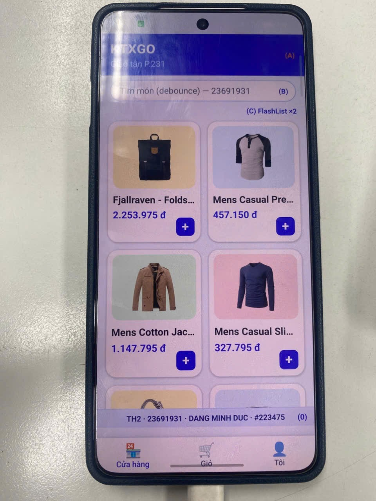
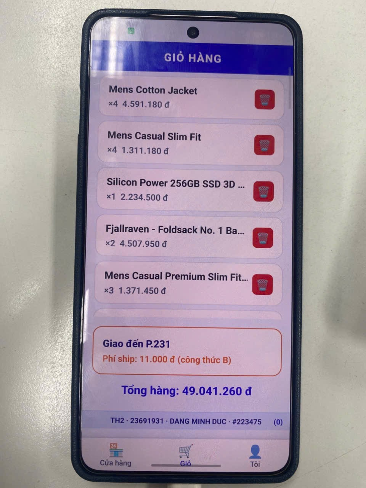

# DANG MINH DUC · 23691931 · https://github.com/minhduc1397/23691931_TH2.git · #223475 · 1 · shopFirst

## KTXGo — Ứng dụng giao đồ tận phòng ký túc xá

**Họ và tên:** DANG MINH DUC  
**MSSV:** 23691931  
**Clone HTTPS:** `https://github.com/minhduc1397/23691931_TH2.git`  
**Stamp:** `#223475`  
**Số cuối MSSV:** 1 · **VARIANT:** shopFirst  

---

## Biến thể (số cuối = 1)

| Thuộc tính | Giá trị |
|---|---|
| Watermark | Dưới |
| Ô đăng nhập | phone |
| Thứ tự Tab | Shop → Giỏ → Tôi |
| Haptic | selection |
| Công thức phí ship | B: `BASE_SHIP_FEE + km×1500 + 2000` |
| Detail presentation | card |

## Cài đặt & chạy

```bash
# Cài dependencies
npm install

# Android
npx react-native run-android
```

## Cây thư mục

```
KTXGo_23691931/
├── App.tsx
├── package.json
├── babel.config.js
├── tsconfig.json
├── docs/
│   ├── screenshot-th2-home.png
│   └── screenshot-th2-cart.png
└── src/
    ├── constants/student.ts
    ├── constants/theme.ts
    ├── hooks/useDebouncedValue.ts
    ├── hooks/useCampusLocation.ts
    ├── services/apiClient.ts
    ├── services/productApi.ts
    ├── stores/authStore.ts
    ├── stores/cartStore.ts
    ├── navigation/RootNavigator.tsx
    ├── navigation/AuthStack.tsx
    ├── navigation/MainTabs.tsx
    ├── navigation/ShopStack.tsx
    ├── components/ProductCard.tsx
    ├── components/Watermark.tsx
    └── screens/
        ├── LoginScreen.tsx
        ├── HomeScreen.tsx
        ├── DetailScreen.tsx
        ├── CartScreen.tsx
        └── MeScreen.tsx
```

## Screenshots



